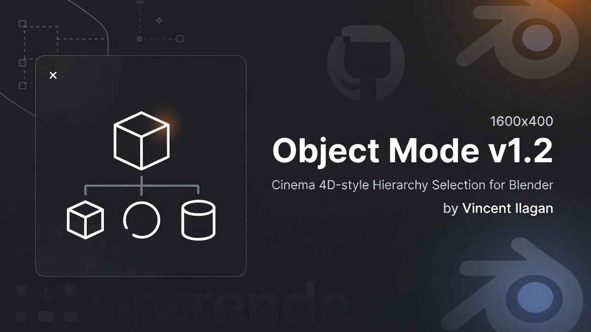

  

# Object Mode v1.2  
### Cinema 4D–style Hierarchy Selection for Blender  
**by Vincent Ilagan**

---

## ✨ Overview

**Object Mode v1.2** brings **Cinema 4D–like selection workflow** into Blender with a major improvement:

- **Click + Hold O** → auto-select **parent + all children**
- **Move / Scale / Rotate** → all selected objects transform **uniformly in world space**, regardless of different scales, rotations, or distances

Perfect for:
- Product visualization  
- Game assets  
- Environment props  
- Animation-ready hierarchies  

---

## 🎮 How It Works

> **Hold `O` → Click any object → Whole hierarchy gets selected → Transform uniformly**

- Detects the **top-most parent**
- Automatically selects **all connected children**
- Sets the parent as the **active object**
- **Uniform transforms**: Moving, scaling, or rotating applies the exact same delta to all children
- Release `O` to return to normal Blender behavior

This mimics the intuitive **Object Mode selection** workflow from Cinema 4D.

---

## 🚀 Features

- ✅ One-click hierarchy selection  
- ✅ World-space uniform transforms for all children  
- ✅ Works in **Object Mode**  
- ✅ Animation-safe and non-destructive  
- ✅ No object joining required  
- ✅ Lightweight & fast  

---

## ⌨️ Default Shortcut

| Action | Key |
|------|----|
| Activate Object Mode selection | **Hold `O` + Left Click** |

> Note: Default Blender **Proportional Editing (`O`)** is automatically disabled during use to ensure uniform transforms.

---

## 📦 Installation

1. Download or clone this repository
2. Open **Blender**
3. Go to **Edit → Preferences → Add-ons**
4. Click **Install…**
5. Select the `.py` file (`object_mode_by_vincent_ilagan_v1_2.py`)
6. Enable **Object Mode v1.2 by Vincent Ilagan**

---

## 🛠 Usage

1. Make sure you are in **Object Mode**
2. Hover your mouse over any object
3. **Hold `O`**
4. **Left-click** on any child mesh
5. 🎉 The **entire model hierarchy** is selected
6. Move, Scale, Rotate → **uniform transformation for all selected objects**

---

## 🧠 Why This Exists

Blender treats each mesh as a separate object even if grouped in collections.  
This add-on restores a **model-centric workflow** and ensures **uniform transformations**, making Blender feel more natural for artists coming from Cinema 4D.

---

## ⚠️ Notes

- Objects must be **parented** properly  
- Collections alone do **not** define hierarchy  
- Works **Object Mode only**  

---

## 🔮 Planned Improvements

- Alt / Shift modifier support  
- Collection-aware selection  
- Visual highlight during hold O  
- Ignore lights/cameras  
- Double-click selection mode  

---

## 👤 Author

**Vincent Ilagan**  
3D Artist / Technical Artist  

---

## 📜 License

MIT License — free to use, modify, and distribute.

If you find this useful, ⭐ the repo and share it with other Blender artists!
